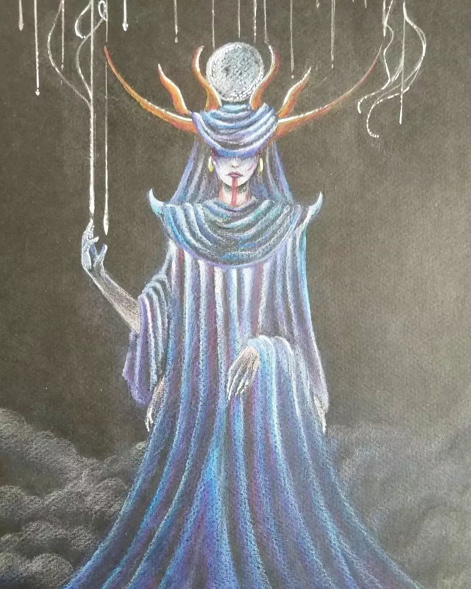

*Mort, protection, inertie, gravité, ordre*

# La légende

Dal Ineis fascine autant qu’elle terrifie. Elle est déesse de la justice, de la magie, de la mort et de la protection. Elle est celle qui enveloppe les mortels de son étouffant voile de velours, celle qui les isole du danger comme de la lumière du jour. Représentée parfois sous les traits d’une femme, parfois sous ceux d’un capricorne, elle est connue pour être une ensorceleuse à la puissance immense appréciant les métamorphoses, de son corps comme de ceux des autres.

L’eline qui se proclama un jour réincarnation de la déesse était dite capable de tuer et de donner la vie d'une pression des doigts. Une femme silencieuse et aveugle, comme les divinités du panthéon. Elle fut suivie d’une assemblée de fidèles avec qui elle traversa le pays, puis les continents, répandant miracles ou châtiments divins sur son passage. On lui offrait une dévotion sans faille. La mortelle reçut de ses suivants autant d’amour que de puissance pure : tant et si bien qu’elle est à ce jour formée de tant de fils que son existence est plus spirituelle que palpable. Elle n’apparaît désormais que rarement aux yeux de tous, préférant la discrétion qui sied à une déesse du silence. Ses temples sont plus entretenus que jamais.

Elle est représentée comme une silhouette fantomatique à quatre bras, vêtue d’un complexe masque d’or ou d'un voile fin et opaque tiré sur le visage, ainsi que d’une épaisse cape de velours noir. De son crâne s'étendent de longs andouillers qui supportent les disques lunaires.

Les temples de Dal Ineis sont les tribunaux et les cimetières, qui sont le plus souvent conçus dans des teintes sombres et drapés de tentures de velours.

# La réalité

La femme qui incarna Dal Ineis faisait partie de la première expédition qui avait pour but d'explorer les ruines avelis, une fois la guerre terminée.
Elle y obtint la capacité d’utiliser et de convertir la foi de ses semblables en puissance de flux. Elle se montrait sage, mais cruelle et impitoyable ; chaque nouveau fidèle lui offrait un fil qu’elle attachait à sa propre personne, accroissant son pouvoir.