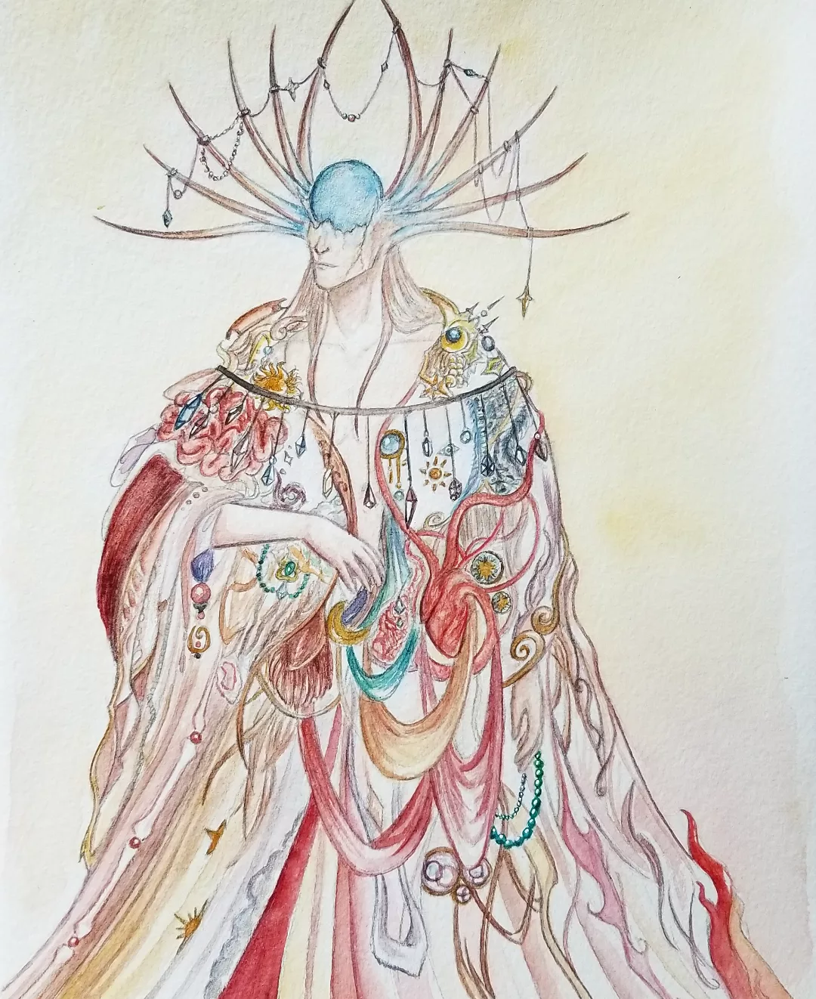

*La vie, le brasier, l’entropie*

# La légende

Dieu-soleil ni homme ni femme, vieux comme le monde, Ios incarne l’équilibre et l’harmonie. Il est porteur du brasier qui est l'origine des fils, source de la vie et de son chaos qu’il contient et harmonise en continue pour former la Trame primaire. On croit trop souvent qu’il s’incarne par le soleil, mais le feu qu’il porte est d’une autre nature. Ce chaos qui représente la vie s’oppose à l’équilibre et l’harmonie totale, eux-mêmes associés au silence, au froid, à l’absence et à la mort : [Dal Ineis](Dal ineis.md). La vie implique l’instabilité, le changement, des transformations constantes et profondes.

Ios est représenté dans un foisonnement organique presque angoissant. Son visage est craquelé et la moitié supérieur est manquante, remplacé par la source du flux. Son corps humanoïde est couvert d'un manteau tissé à même sa peau où se mélange os, muscles, chairs, veines, or, métal ouvragé, perles, cristaux, flammes, étoiles, rubans, fourrure.

Ses temples sont des endroits dédiés, toujours chaud et lumineux. De grands feux brûlent en continu, entretenu par les [prêtres](<../Les ordres/Les prêtres.md##pretres-d-ios>). Le plafond est en verre, et des attrapes-soleil (des atsols) diffractent la lumière en myriades d'arc en ciel sur le sol ; des mosaïque ouvragés ornent les murs. Il est malvenu d'y entrer vêtu de noir.

# La réalité

L’homme qui incarna Ios faisait lui aussi parti de la première expédition visant à investiguer les ruines [avelis](<../../Nations non-humaines/Avelis.md>), comme [Dal Ineis](Dal Ineis.md). Il s'appropria les secrets anciens les plus puissants aussitôt. Cela lui causa un sommeil profond de quelques dizaines d'années, pendant lesquelles Dal Ineis commença à ériger son culte.
Lorsqu'il se réveilla, il obtint d’abord le contrôle des sources de chaleur, puis de pans entiers de la Trame elle-même ; il en déchira alors un morceau riche en flux, le Coeur, et y raccorda son propre être avant de le recoudre à la Trame sous forme d’une petite poche de l’univers. Il s’assurait ainsi une source de pouvoir, un lac de flux, uniquement à sa disposition et protégé de toutes intrusions étrangères. Il appela ce lieu « [Felithis](<../../Nations humaines/Felithis.md>) » et y hébergea ses fidèles, exigeant d’eux de protéger et de chérir ce monde qu’il leur offrait.

Dal Ineis fut particulièrement outrée de cette action, et exigea accès au Coeur, qu'Ios refusa.
Le conflit qui en résulta dure encore aujourd'hui.