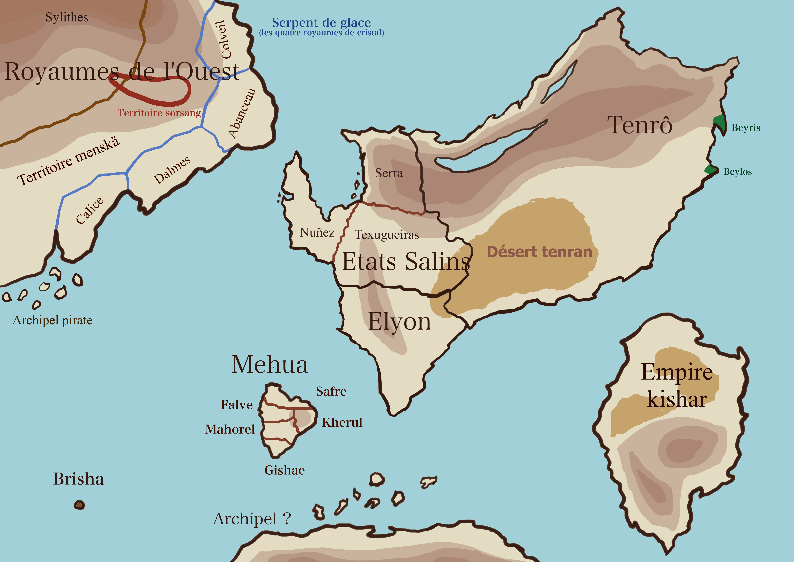

```table-of-contents
```


# Avant les humains

## Titans

Au commencement d’[Ios](Dieux/Ios.md) furent les titans. Ces créatures immenses modelèrent les continents, scindèrent la terre, inondèrent les océans, déchirèrent les crêtes des montagnes de leurs dents.
On retrouve encore des traces évidentes de ces événements dans les lacs des montagnes [tenranes](../Nations\ humaines/Tenrô.md), larges cicatrices béant dans la roche. Ils semblent aujourd’hui que ces titans soient assoupis, ou tout du moins d’une infinie lenteur à leur tâches : en témoigne des observations indéniables de mouvement du paysage sur des durées longues. Leur règne est estimé à un éon. 

## Peuples d'antan

Plusieurs créatures prirent possession de chaque espace vide et fertile, animées par le feu d’Ios. Les [avelis](Avelis.md) descendirent du ciel pour ériger de belles cités de marbre blanc ; des profondeurs des océans vinrent les [delphènes](Delphènes.md), qui construisirent à leur tour, avec l’aide de [titans](#Titans) sous-marins encore éveillés, leur cité de cristal d’ambre sous l’île de [Mehua](Mehua). Enfin, des montagnes et des forêts émergèrent [sylithes](Sylithes.md), [sorsèves](Sorsèves.md) et [sorsangs](Sorsangs). De toutes les créatures qui s’animèrent et peuplèrent la terre, ces cinq se démarquèrent par leur structures, villes comme organisations sociale, ainsi que leur intelligence.
Si la mer et les montagnes abritent encore les peuples anciens qui y ont toujours vécu, ce n’est pas le cas des continents. Ceux-ci étaient autrefois largement dominés par les [sorsangs](Sorsangs), à l’intérieur des terres et au sud, et les [avelis](Avelis), sur les côtes septentrionales.  
 
Leurs dieux étaient les forces implacables qui régissaient l’univers. Les lois de la physique, la nature, interprétées et personnifiés ; mais nul doute n’était laissé au fait que ces divinités n’étaient que concept et non êtres pensants, tout de même révérées pour leur puissance et leur importance dans l’équilibre des choses, qu’elles incarnaient même.

Empires en expansion, la rencontre entre ces cultures fut inévitable, entraînant l’apparition d’hybrides de plus en plus nombreux. Ceux-ci possédaient systématiquement moins de caractéristiques d’espèces que leurs parents. Ils ne possédaient que rarement plumes, écailles, ailes, nageoires ou instinct du flux aussi puissant que leurs géniteurs. De plus, plus ils s’éloignaient des morphologies connues, plus ils étaient fertiles : ainsi naquirent ceux qu’on appela plus tard « humain », ou du moins la première génération qu’il en fut.

#  Émergence de l'humanité

## Naissance des royaumes occidentaux

Après environ 5 000 ans de règne paisible des [peuples anciens](##Peuples d'antan), les hybrides s’affirmèrent et s’établirent en [royaumes](Royaumes occidentaux), en paix et soumission des peuplades anciennes due à leur évidente infériorité, numérique comme physiologique. Ils recevaient de leur part quelques terres, un peu d’indépendance, leurs arts et leurs sciences ; car les [avelis](Avelis) comme les sorsangs étaient trop arrogants pour accepter ces êtres difformes dans leurs propres cités.

Mais les générations suivantes, toujours plus faibles, sans don, sans plume et sans écaille ne reçurent qu’un mépris grandissant de la part de la précédente génération d’hybrides et des peuples d’antan. Leurs seigneurs croyant qu’ils risquaient d’entraîner le déclin de leurs fragiles royaumes en acceptant ces avortons, ils étaient régulièrement rejetés, réduits en esclavage par les [avelis](Avelis) ou les [sorsangs](Sorsangs), pendant que la consanguinité perdait la royauté qui cherchait désespérément à protéger son sang pur.

## La grande révolte

C’est alors qu’un guide éleva une voix forte parmi les esclaves. Il s’appelait [Barshah](Barshah). Il rassembla les hybrides et leur donna le nom d’Homme. Fort de leur unité nouvelle, ils se rebellèrent face aux [avelis](Avelis) et aux [sorsangs](Sorsangs) ; d’abord silencieusement, en développant des armes nouvelles, d’acier et de fer, pour palier à leur incapacité d’user de la magie avec autant d’aisance que les peuples anciens ; puis enfin en laissant éclater la révolte et en faisant preuve d’un instinct militaire et stratégique supérieur aux anciens. Ils gagnèrent la longue et sanglante guerre qui s’en suivit.

## Les nouvelles nations

A la chute des [avelis](Avelis), les humains fondèrent sept nouveaux états. [Tenrô](Tenrô) fut juste un nom donné à l’étendu de sable et de roche par-delà les montagnes, où des tribus s’étaient déjà établies en toute sérénité. Mehua fut le nom donné à l’île peuplé de delphènes neutres vis-à-vis de ces nouveaux occupants des terres. L’empire Kishar s’érigea sur ce qu’il restait du continent sorsang. Le continent central fut d’abord considéré comme un seul nouvel état ; mais les différences étaient telles entre ceux du nord et ceux du sud qu’on le refusa. Au sud, on clamait nécessiter un pays à part entière car c’était là que les ruines de la capitale et des importantes cités avelis se trouvaient, ce pays devint Elyon ; on argumentait aussi un climat différent. Au nord, d’autres litiges similaires menèrent à la scission du pays pour finalement constituer les trois états salins.

Lors de la chute des empires précédents, les dirigeants humains firent main basse sur nombre de secrets de puissances et de magies anciennes, procédés dangereux que les avelis répugnaient à utiliser par respect pour leur dieu, l’équilibre du monde. Ces hommes ne se privèrent pas de s’en servir, incarnant grâce à leur nouveau pouvoir proche du divin les dieux de leur religion ; pouvoir encore accru par la foi sans faille de leur peuple. C’est ainsi qu’en suivit une ère de miracles et d’actes saints, où des mondes secrets furent créer, le destin modifié, les lois de la Trame ignorées et brisées. Pour les hommes, c’était un âge d’or. Seuls les plus grands, encore à ce jour, savent la vérité sur l’usurpation des divinités : ils ne se privent pas d’en jouer pour influencer la politique mondiale.

Le panthéon humain utilise ainsi les même noms et figures divines que les avelis, auxquelles s’ajoutent Barshah et quelques autres figures mineures purement humaine. Cependant, ils voient leurs dieux comme des êtres conscients, prie, font des offrandes, à la différence de la façon dont les avelis ou [sorsangs](Sorsangs) vivaient la religion.

# Monde actuel

Face à ce désastre, les [sorsangs](Sorsangs) et les avelis qirent des entités sombres, chargées de détruire ces faux dieux pour rétablir l’équilibre avant que les conséquences du contrecoup ne deviennent trop lourdes pour l’ensemble des habitants des terres d’Ios. Vus par la population, qui ignore tout de cette manipulation, comme des démons envoyés par vengeance, ceux-ci furent chassés, traqués, emprisonnés, comme le sont encore avelis et [sorsangs](Sorsangs). Une coalition d’aptis lutte activement contre ces créatures mystérieuses, appelés éthers, et perçues comme des menaces.

Le présent se situe environ 500 ans après la grande révolte.

[Le récit que je compte poser sur ces bases-là exploreraient donc le clivage entre ces deux camps :

Ceux qui souhaitent que les humains gardent ce pouvoir là (qui n’est tenu que par les plus puissants) afin de lutter contre le sort et les forces inéluctables qui dirigent le monde plutôt que de s’y soumettre, bien que le contrecoup éventuel soit terrible ; et ceux qui souhaitent leur arracher parce que tout cela n’est que mensonge, manipulation, et envoie le monde à sa perte.]

